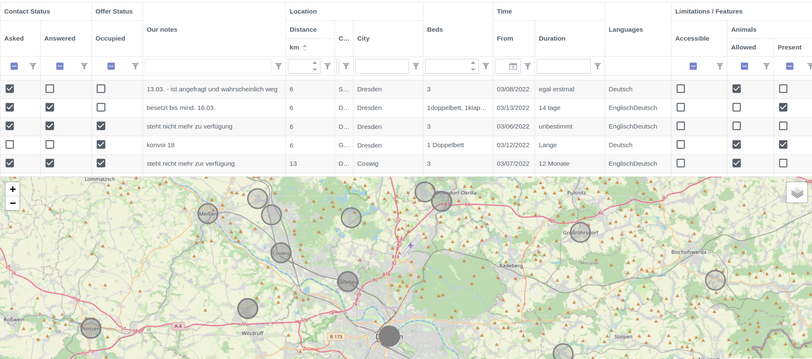

This repository contains tools for NGOs, organizing private hosting.

## Import / Transformation / Merging / Export of existing datasets

- [x] https://mission-lifeline.de/unterkunft-bereitstellen/
- [x] https://warhelp.eu/
- [x] other Datasets created from Wordpress-Forms or Google-Docs
- [x] Tables in one of this file formats: xlsx, csv, json, edn, xml

If you need help to use our software with your data, please contact us…

## A secure / robust / scalable **backend**, usable by all NGOs

Every NGO can decide between self-hosting the backend or using a backend provided by us.

Implemented by reusing the technology stack of [swlkup](https://github.com/johannesloetzsch/swlkup)

## A frontend for authorized NGO members, to **search** the database

A website [based on reactdatagrid](https://reactdatagrid.io/) allows easy filtering and sorting of results. The usage of finding matches is much more convenient than working with a regular spreadsheet.

- [x] Beta version is online
- [x] Filtering + Sorting by any column
- [x] Editable columns (realtime collaboration)
- [x] Map view and search by distance

A [user manual](./docs/user-guide/user-guide-en.md) is available in [English](./docs/user-guide/user-guide-en.md) and [German](./docs/user-guide/user-guide-de.md).

## A customizable public form, to submit new offers

There is no need to use this component for NGOs happy with their existing solution. Instead they can use the [import function or an API adapter](#import--transformation--merging--export-of-existing-datasets).

- [ ] An optional new form should be available soon.

# Contributing

See the [developer facing documentation](./docs/DEVELOPMENT.md) and the documentation of the [Architecture](./docs/ARCHITECTURE.md). 
There is also a README.md for each component in it's directory.
