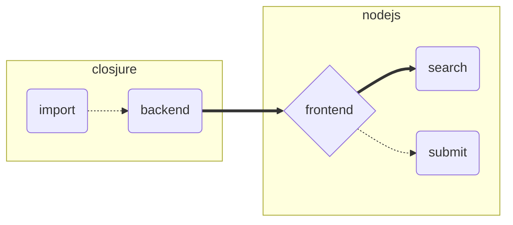
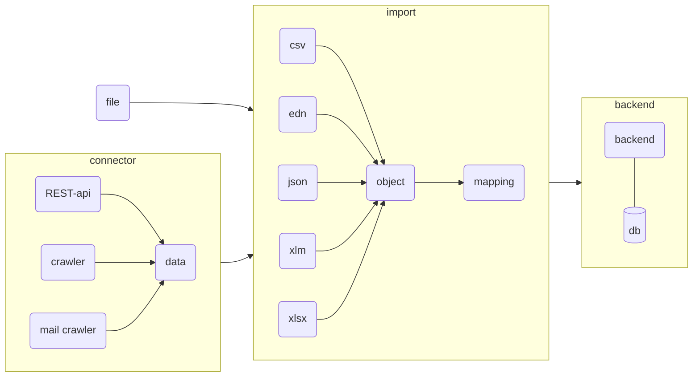

This repository contains tools for NGOs, organizing private hosting.

## Import of existing datasets

- [x] https://mission-lifeline.de/unterkunft-bereitstellen/
- [x] https://warhelp.eu/
- [x] https://www.dhdd.info/
- [x] https://icanhelp.host/ (public API)

