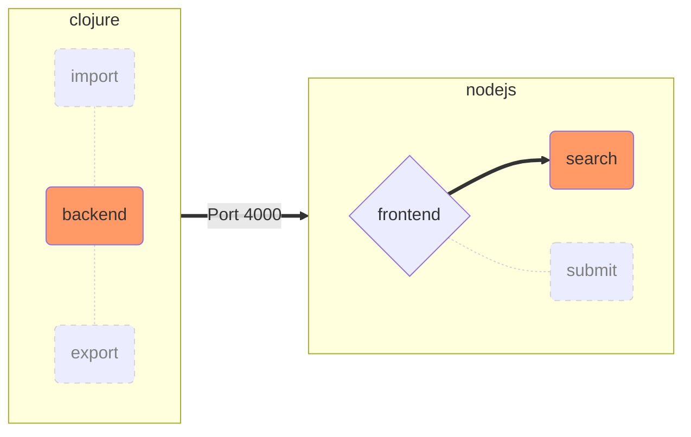
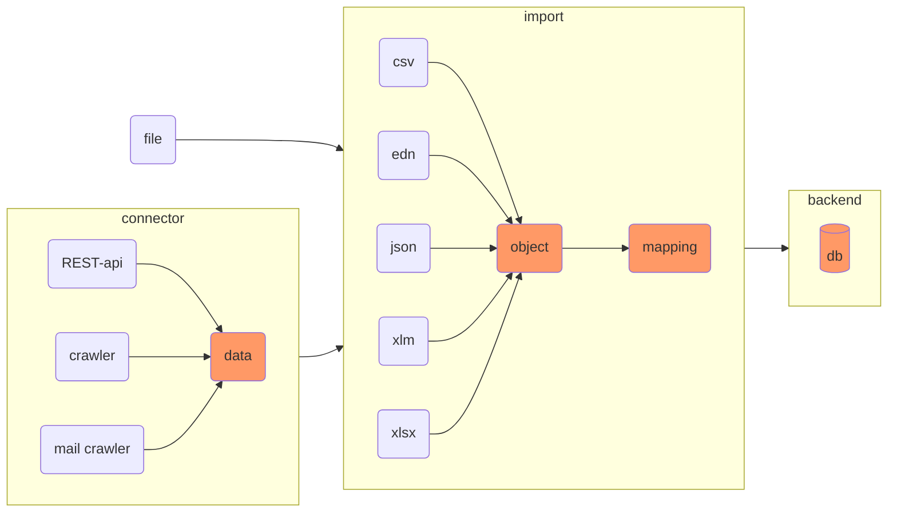

```mermaid
flowchart LR;
    classDef focus fill:#f96;
    classDef hide_ color:gray , stroke-dasharray: 5 5 , stroke:lightgray;
    subgraph clojure
        I(import):::hide_ -.- B(backend):::focus
        B -.- e(export):::hide_
    end
    subgraph nodejs
        direction LR
        C{frontend}
        C ==> D(search):::focus
        C -.- E(submit):::hide_
    end
    clojure ==Port 4000==> nodejs
    linkStyle 0 stroke:lightgrey;
    linkStyle 1 stroke:lightgrey;
    linkStyle 3 stroke:lightgrey;
```

```mermaid
flowchart LR;
    classDef focus fill:#f96;
    subgraph connector
        direction LR
        c_a(REST-api) --> d 
        c_c(crawler)--> d
        c_m(mail crawler) --> d(data):::focus
    end
    subgraph import
        direction LR
        c(csv) --> o(object):::focus
        e(edn) --> o
        j(json) --> o
        xlm(xlm) --> o
        xlsx(xlsx) --> o
        o --> I(mapping):::focus
    end
    subgraph backend
         db[(db)]:::focus 
    end
        c_f(file) --> import
    connector --> import
    import --> backend
```
