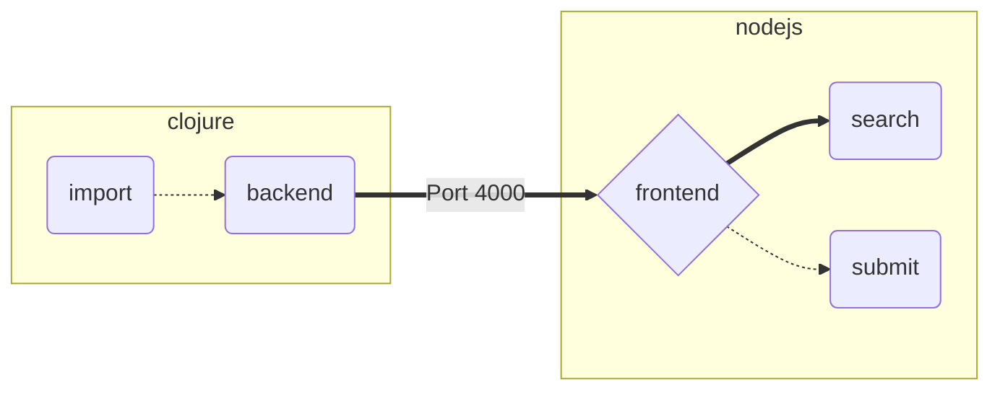
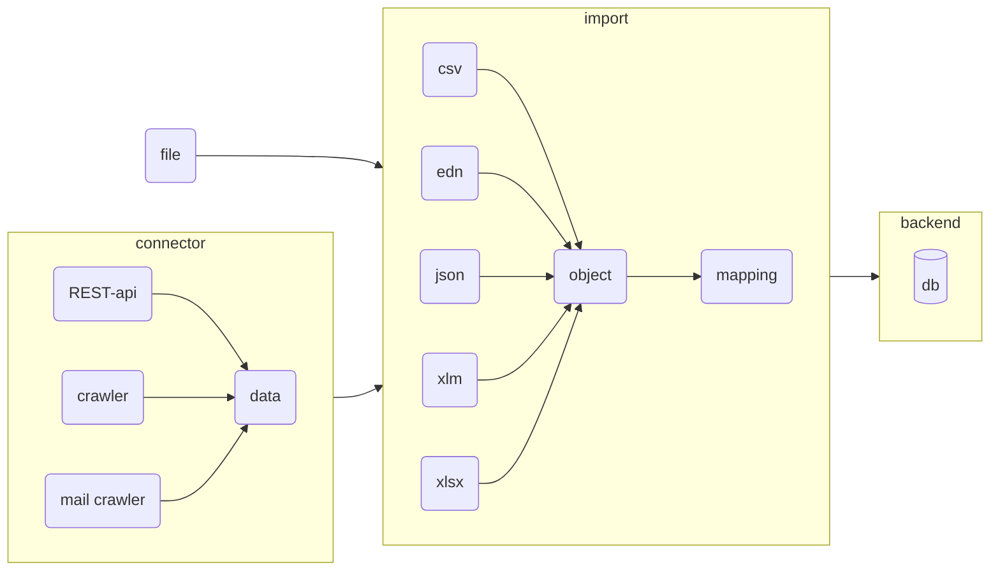

```mermaid
flowchart LR;
    subgraph clojure
        I(import) -.-> B(backend)
    end
    subgraph nodejs
        B ==Port 4000==> C{frontend}
        C ==> D(search)
        C -.-> E(submit)
    end
```

```mermaid
flowchart LR;
    subgraph connector
        direction LR
        c_a(REST-api) --> d 
        c_c(crawler)--> d
        c_m(mail crawler) --> d
        d(data)
    end
    subgraph import
        direction LR
        c(csv) --> o(object)
        e(edn) --> o
        j(json) --> o
        xlm(xlm) --> o
        xlsx(xlsx) --> o
        o --> I(mapping)
    end
    subgraph backend
        db[(db)] 
    end
        c_f(file) --> import
    connector --> import
    import --> backend
```
