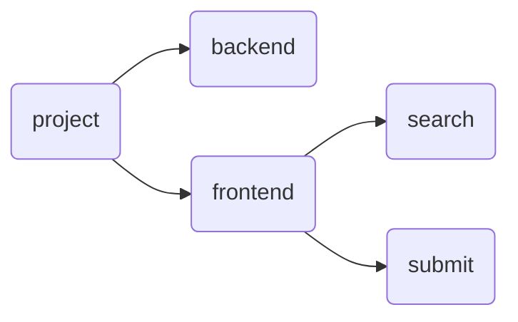
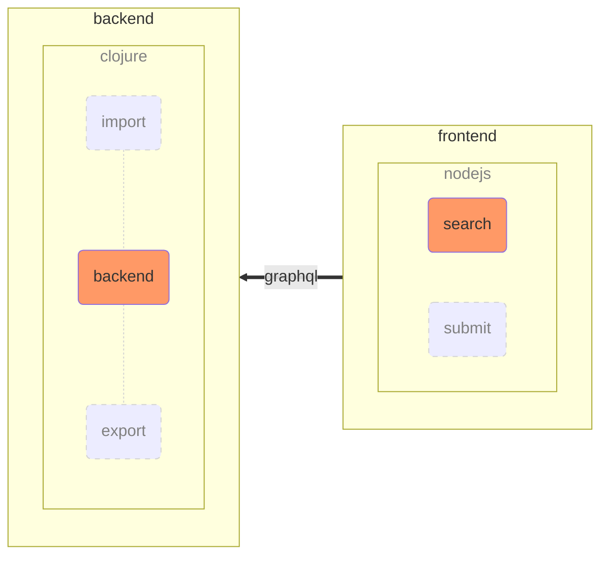
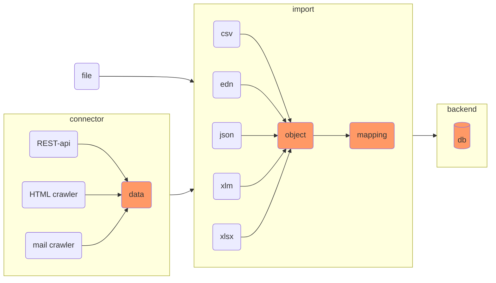

## Overview

As described, the project is based on a backend and a separate frontend. The structure of the file system represents this.

While the backend runs on Clojure, the frontend is built with React and queries data via the Graphql interface.

## Import pipeline

The import and export function is currently tied to the backend. Data to be
imported is piped from the source to the internal database (rocksdb). Through
several steps, imports can be customized. The connector collects data from the
source (APIs, crawling for HTML/E-Mail) or from supplied files.

**1st step - Extracting** Delivered formats are loaded into objects. In general we expect 2 dimensional data - the data set.

**2nd step - Loading** A dataset contains multiple tupel. A tupel in turn consists of multiple attributes. Imports may support separate headlines. In case of csv the first row could be a headline. Usually each csv-row is a tupel/data point.

**3rd step - Mapping** The internal 2-dimensional data grid is mapped with help of associative attribut naming. Further rules, checks and specialised functions are added - see 'offer_mapping'. This allows to handle customer specific representation of boolean values or time string formats.

Graphql allows generic access to the database. This way only the mappers have to
deal with the specific customer related data model. To enable the merging or
exchange of different data models, another mapping is applied. The so-called key
mapping generates a key/fingerprint to match data containing only key-attribute
tuples across different data models by a hash value.
