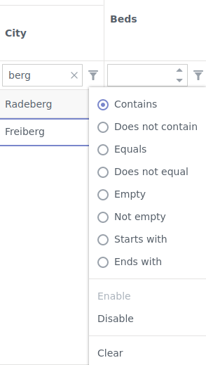

# Beherbergung Software

**Contact:** <internet-for-refugees@lists.c3d2.de>

## Login und Authentifizierung

Die Authentifizierung/Login ist zweistufig, als Erstes wirst du nach deinem Organisations-Login gefragt.

Danach siehst du einen minimalen Dialog, welcher dich nach deinen Benutzer-spezifischen Login-Credentials fragt.

## Nach Einträgen Suchen

- Prinzipiell ist der Kopf jeder Spalte interaktiv. Durch schreiben in den Spalten Kopf können Suchkriterien zusammen gestellt werden.
Die Suchergebnisse werden dann direkt in der Tabelle darunter dargestellt.

### Navigation der UI

- **Struktur:** Auf der unteren Hälfte der Oberfläche ist eine Karte, wo die verschiedenen Wohnungen eingetragen sind. 

- **Tabelle zu groß:**Ich möchte noch auf den Slider an der Kante zwischen Map und Tabelle aufmerksam machen um auch den rechten Rand der Tabelle betrachten zu
können. Nach klicken in die Tabelle kann diese auch durch die Cursor-Tasten verschoben werden.

<!---->
Es wird, dass die Wohnung in dem jeweiligen grauen Kreis ist. Bei genauen Ortsangaben ist das Zentrum des Kreises der Ort.
-->

### Suchen und Sortieren

- **Suche:** Die Tabelle kann nach den meisten Spalten gefiltert werden. Dafür einfach in der Zeile zwischen dem Tabellenkopf und der ersten Zeile mit Angeboten eingeben. Mit dem Filtersymbol das in dieser Zeile in
jeder Spalte ist, können weitere Optionen fürs Filtern ausgewählt werden. z.B. „enthält den eingegebenen Text“ oder „Spalten die angezeigt werden sollen, müssen einen Wert haben der mindestens so groß wie der eingegebene Wert ist“. Bei den meisten Spalten haben wir bereits eine sinnvolle Vorauswahl.

- **Spalten Typen:** Der Tabellenkopf enthält Eingabe-Felder, womit sich suchen lässt. Das Format des Spaltenkopfs ist dabei abhängig von der jeweiligen Spalte mögliche Formate sind z.B Zeichenketten, Ganzzahlen, Checkboxes oder Datumsangaben. Wenn eine Spalte einen inkorrekten Typ hat sagt uns gerne bescheid.

- **Filter anpassen:** Die Filtermethode für einen Spaltenkopf ist in den meisten Fällen die Gleichheit oder Beinhaltet. Diese kann aber auch verändert werden durch die Trichter-Symbol (siehe Bild).

- **Filter/Suche Zurücksetzen:** F5 lädt die Seite neu und setzt somit alle Filter zurück.

- **Tabelle Sortieren** Die Tabelle kann nach beliebigen Spalten sortiert werden. Dafür einfach auf die Überschrift der Spalte klicken z. B. „Beds“ oder „km“. Nochmal darauf klicken dreht die Sortierreihenfolge um. Beim dritten Klick wird die Sortierung aufgehoben.

### Nutzung der Karte

- In der Tabelle gibt es die Spalte Distanz, diese Distanz wird von aktuellen Karten Mittelpunkt zu der jeweiligen Wohnung berechnet.

- Wenn du z.B nach Orten im Dresdner Zentrum sucht richtest du deine Karte so aus das diese auf das Zentrum zeigt und sortierst dann die Einträge in der Tabelle nach der Distanz absteigend.

### Fehler / Bugs gefunden.

- Bitte schreibe uns eine Mail mit einer kurzen Beschreibung wie es zu diesem Fehler kam. Mit einer Anleitung wie man diesen Fehler reproduzieren kann. Screenshots sind meistens auch sehr hilfreich zudem potenziell deine Browser + Version.

