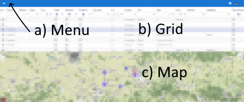
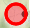
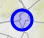
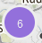
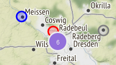

# Beherbergung Software

**Contact:** <internet-for-refugees@lists.c3d2.de>

## Login und Authentifizierung

Die Authentifizierung/Login ist zweistufig, als Erstes wirst du nach deinem Organisations-Login gefragt.

Danach siehst du einen minimalen Dialog, welcher dich nach deinen Benutzer-spezifischen Login-Credentials fragt.

## Die Elemente der Oberfläche (GUI)

Die Oberfläche enthält neben dem **a) Toolbar mit Menü** die Daten in Form einer **b) Tabelle**. Sind die Daten mit gültigen Ortsangaben versehen werde diese in der **c) Karte** unten dargestellt.

### Toolbar

Die Toolbar erlaubt Zugriff auf  Menu, Login und den Wechsel der GUI-Sprache.

### Tabelle

Dieser Teil stellt die Daten tabellarisch dar.

### Karte

Zur Verdeutlichung werden unterschiedliche Marker verwendent.

- Für den aktuellen  (die in Tabelle ausgewählte Zeile).
- Für die ausgewählten 
- ... und nicht aktiven  (über in Tabelle gesetzte Filter).
- Oder als Gruppe  aktive Marker (bei gesetzter Gruppierungs-Option).

In der Karte sieht das dann so aus

und nun alles zusammen ...

### ohne Gruppierung

### mit Gruppierung

## Arbeit mit Tabelle

### Navigation in Tabelle

#### Tabelle zu klein

Die Platzaufteilung von Kante und Tabelle kann angepasst werden, indem man mit der Maus die Grenze zwischen Karte und Tabelle verschiebt.

#### In der Tabelle navigieren

Nach klicken in die Tabelle, kann diese durch die Cursor-Tasten (Pfeiltasten) werden.

### Suchen und Sortieren

- Prinzipiell ist der Kopf jeder Spalte interaktiv. Durch schreiben in den Spalten Kopf können Suchkriterien zusammen gestellt werden.
  Die Suchergebnisse werden dann direkt in der Tabelle darunter dargestellt.

- **Suche:** Die Tabelle kann nach den meisten Spalten gefiltert werden. Dafür einfach in der Zeile zwischen dem Tabellenkopf und der ersten Zeile mit Angeboten eingeben. Mit dem Filtersymbol das in dieser Zeile in
  jeder Spalte ist, können weitere Optionen fürs Filtern ausgewählt werden. z.B. „enthält den eingegebenen Text“ oder „Spalten die angezeigt werden sollen, müssen einen Wert haben der mindestens so groß wie der eingegebene Wert ist“. Bei den meisten Spalten haben wir bereits eine sinnvolle Vorauswahl.

- **Spalten Typen:** Der Tabellenkopf enthält Eingabe-Felder, womit sich suchen lässt. Das Format des Spaltenkopfs ist dabei abhängig von der jeweiligen Spalte mögliche Formate sind z.B Zeichenketten, Ganzzahlen, Checkboxes oder Datumsangaben. Wenn eine Spalte einen inkorrekten Typ hat sagt uns gerne bescheid.

- **Filter anpassen:** Die Filtermethode für einen Spaltenkopf ist in den meisten Fällen die Gleichheit oder Beinhaltet. Diese kann aber auch verändert werden durch die Trichter-Symbol (siehe Bild).

- **Filter/Suche Zurücksetzen:** F5 lädt die Seite neu und setzt somit alle Filter zurück.

- **Tabelle Sortieren** Die Tabelle kann nach beliebigen Spalten sortiert werden. Dafür einfach auf die Überschrift der Spalte klicken z. B. „Beds“ oder „km“. Nochmal darauf klicken dreht die Sortierreihenfolge um. Beim dritten Klick wird die Sortierung aufgehoben.

## Nutzung der Karte

- In der Tabelle gibt es die Spalte Distanz, diese Distanz wird von aktuellen Kartenmittelpunkt zu der jeweiligen Wohnung berechnet.

- Wenn du z.B nach Orten im Dresdner Zentrum suchst richtest du deine Karte so aus das diese auf das Zentrum zeigt und sortierst dann die Einträge in der Tabelle nach der Distanz absteigend.

<!-- Hier könnten/sollten wir noch beschreiben welche Links es zwischen Karte und Tabelle gibt -->

## FAQ

<!--  // Das ist Reduntand zu dem was in „Nutzung der Karte“ steht, sehe da keine Mehraussage
### Wie werden die Entfernungen berechnet?
Alle Entfernungen werden auf den Punkt in Karten bezogen. Somit ändern sich diese mit verschieben der Karte. Dies hat somit direkt Einfluss auf den Entfernungs filter. Wenn also in der Entfernungs-Spalte eine Filter-Kriterium (sprich eine Bedingung) angegeben ist, wechseln sich ggf. die Marker wenn die Karte verschoben wird.
-->

### Worauf zeigt der Marker?

Bei genauen Ortsangaben ist das Zentrum des Kreises der Ort. Der Marker ist natürlich nur so genau wie die Ortsangaben in den Daten.

<!-- Künftig werden Orte zu denen wir genauere Standorte haben (PLZ / Straße) wahrscheinlich genauer angezeigt. Im Moment hängt es noch vom Datensatz ab. -->

## Fehler / Bugs gefunden.

- Bitte schreibe uns eine Mail mit einer kurzen Beschreibung wie es zu diesem Fehler kam. Mit einer Anleitung wie man diesen Fehler reproduzieren kann. Screenshots sind meistens auch sehr hilfreich zudem potenziell deine Browser + Version.
