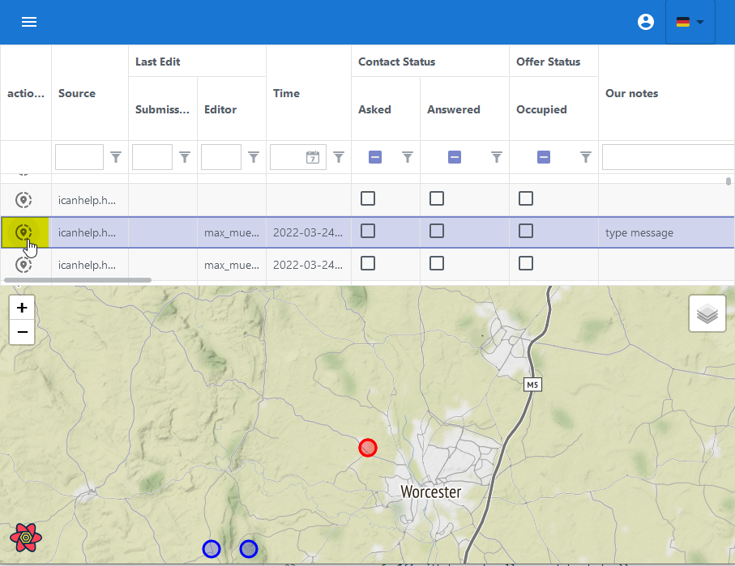
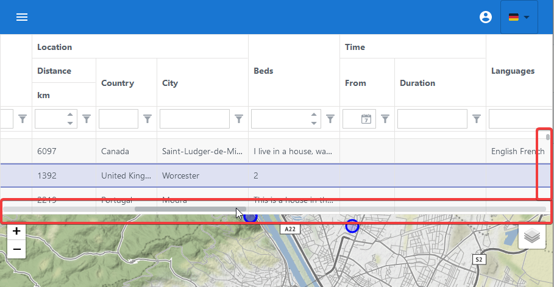
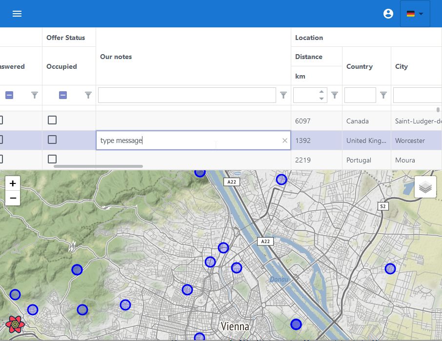

# Accommodation Software

**Contact:** <internet-for-refugees@lists.c3d2.de>

## Login and authentication

Authentication/login is a two-step process. First, you will be asked for your organization's login.

Then, a minimal dialog is displayed asking for your user-specific credentials.

## User interface (GUI)

The user interface contains a **a) toolbar with menu**. The middle part is showing the data as **b) table grid**. Whilst below a **c) map** is shown. Valid location data can be pin pointed here.

### Toolbar

The  menu, login and language selection can be accessed by on top of the screen - via toolbar.

### Table Grid

Data are show as Grid here. Please find more details to features below.

### Map

Location data are marked on the map. Markes are colored to visualise the state.

- current entry  (currently selected grid row)
- filtered  (grid rows matching filter values)
- hidden  (grid rows not matching filter values)
- grouped  filter markers (on enabled grouping option)

in the end a map might look like

now all put together

### Grouping

The grouping of markes can be enabled/disabled in setting (via toolbars menu).

#### Without grouping

#### With grouping

## Working with grid table

### Navigation in grid table

#### Resizing the grid table

The grid table can be resized by mouse draging. To do so please click and drag the line separeting grid-table and map.
<!--todo add image-->

#### Navigation by keyboard

To use keyboard navigation please activate grid by clicking onto a table row. Done that, the cursor key will move the selection within the grid. Changing rows will instantly update the marker  to indicate current entry. Certainly this considers grids and maps visual limits.

#### Navigation by map

Table entries can be selected via map. Clearly this will only work for rows that are visible - and not filtered out. To change the selection just click the  marker on the map. To show the new selection the table might scroll up or down on its own.

#### Navigation by grid

To force the map to current rows location just click the  link from table grid. The map will scroll to show the location.

#### Navigation by scrollbars

To fastly move accross the table grids data use the scrollbars. They are located on the line between grid and map and to the right hand side. Scrollbars are hidden by default. Getting close to it with your mouse will show them up. 

### Filter and Order

- In general column heads are interactive. Values to search for/with can be set in offered input fields at column heads. The will be applied instantly in the tables grid.

- **Filter:** They majority of columns allow to used as filter. This allows filter to check for "contains text", "equal", "value must be less than" etc. - some essentials columns are preset to "commen sense".

- **Filter operation:** The filter operation can be access by clicking on filter symbol next to search input field. Offered operations depend on columns data type.

- **Reset:** F5 will reload the page and reset all filters and filter opertaions.

- **Column Types:** Columns look and search capabilites are dependend on the data type to show. Columns can handle String, Numbers, Checkboxes or Dates. The types are preset. Please give us a shout if that won't fit.

- **Sorting** The table can be sorted by any columns. A click on columns name in grids head will sort it. Reverse sorting is issued on 2nd click. The 3rd click will remove the sorting.

### Edit mode

Doubleclicking a cell starts the edit mode. The cell will change into an input box. To keep editing press `<Tab>`. That will save current cells new value and move to next column in edit mode. Using the `<Enter>` key instead will move to next row in edit mode. Finally to finish edit mode press `<ESC>`.

## FAQ

### How is distance calulated ?

The grid column distance is calculated by the maps centerpoint. Moving the map will force a recalculation of distances. This might recalculate filters. In turn markes might change colors too by moving the map.

For example, if you are looking for places in the center of Dresden, align  your map so that it points to the center and then sort the entries in the table by distance in descending order.

### What does the marker pin point?

Given the location is very accurate - the center of the marker is the exact location. It is obvious that markes only as correct as the location data.

### Error / Bugs found.

- Please send us an email with a brief description of how this error occurred.
  With instructions on how to reproduce this error. Screenshots are usually also
  very helpful, as well as possibly your browser + version.
