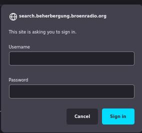
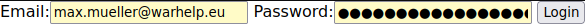
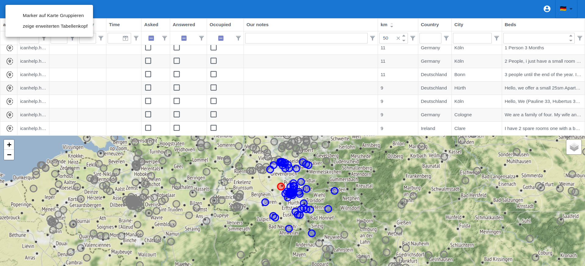
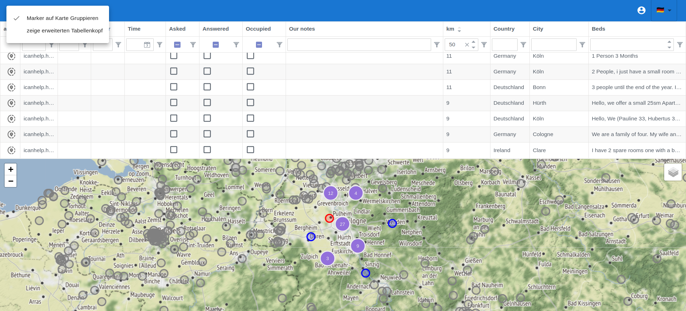
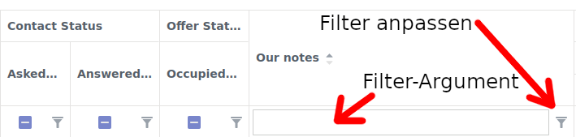

# Accommodation Software

**Contact:** <internet-for-refugees@lists.c3d2.de>

## Login and authentication

Authentication/login is a two-step process. First, you will be asked for your organization's login.

Then, a minimal dialog is displayed asking for your user-specific credentials.

### Navigation of the UI

- **Structure:** In the lower half of the user interface, there is a map showing the locations of the apartments.
- **Table too small:** On the edge between the map and the table there is a handle that allows you to change the size of the area used for the table and the map.

- **Navigating the table** After clicking in the table, you can move it with the cursor keys (arrow).

<!--

It becomes that the flat is in the respective grey circle. For exact locations, the centre of the circle is the location.
-->

### Search and sort

- In principle, the heading of each column is interactive. You can compose
  search criteria by writing in the column heading. The search results will then
  be displayed directly in the table below.

- **Search:** The table can be filtered by most columns. To do this, simply
  write in the line between the table heading and the first line with offers.
  With the filter symbol, which is in this line in for example "contains the
  entered text" or "columns to be displayed must have a value at least as large
  as the entered value". For most columns we have already made a reasonable
  preselection.
- **Column types:** The table header contains input fields that can be used for
  searching. The format of the column header depends on the column. Possible
  formats include strings, numbers, checkboxes, or dates. If a column has an
  incorrect type, please let us know.

- **Customize the filter:** The filter method for a column header in most cases
  is equals or contains. However, this can also be changed using the funnel icon
  (see figure).

- **Reset Filter/Search:** The F5 key reloads the page and resets all filters.
- **Sort Table** The table can be sorted by any column. Just click on the column
  heading, e.g. "Beds" or "km". Another click on it reverses the sort order. The
  third click cancels the sorting.

### Using the map

- In the table there is the Distance column. This distance is calculated from
  the current map center to the respective apartment.
- For example, if you are looking for places in the center of Dresden, align
  your map so that it points to the center and then sort the entries in the
  table by distance in descending order.

### Error / Bugs found.

- Please send us an email with a brief description of how this error occurred.
  With instructions on how to reproduce this error. Screenshots are usually also
  very helpful, as well as possibly your browser + version.
